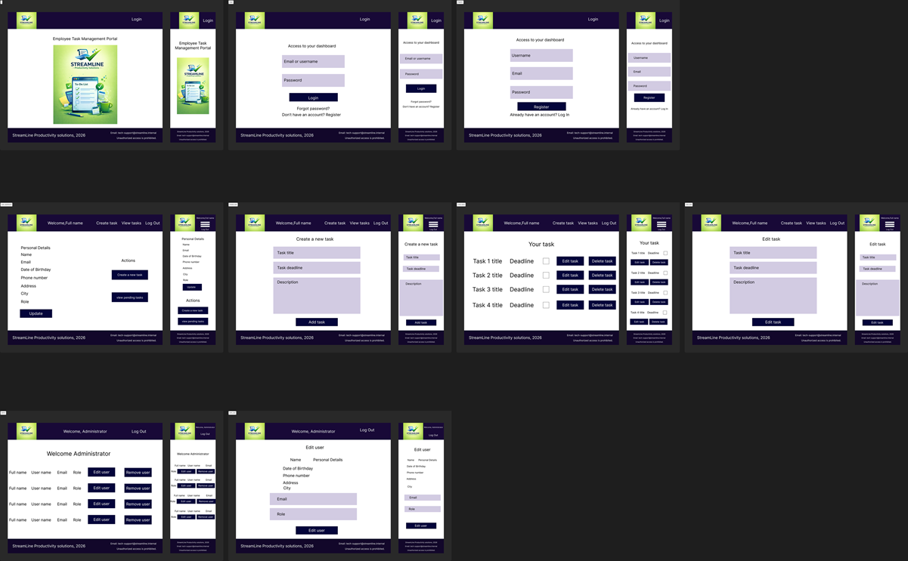
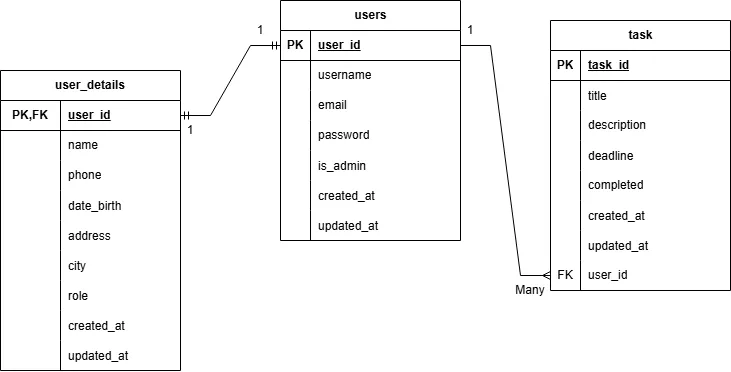

# To-Do List

## Project Purpose

The purpose of this project is to design and develop an internal taska management for a fictional company (Streamline Productivity Solutions).

This project is developed as a guided walkthrough project for the Unit 3 - Level 5Web Development, led by Jose.

## Project Planing

### User stories

This project conatains several user stories for users and aminitrators.  
User stories can be checked [here](documentation/user_stories/user_stories_to_do_list.pdf)

### Colour decisions

The colour palette for this project was selected based on principles of usability, accessibility, and design standards.

Colour choices were made following accesibility best practices:
* High contrast between text and background to improve3 readibility.
* Clear Visual differentiation between button actions.

**Contrast Colour Validation**

### Design - Wireframes

If you want to check individual designs plese click [here](documentation/design/design.md)

### Database - Design

For this project three tables have been designed. You can finde the data types for each field [here](documentation/database_design/database_design%20-%20tables.pdf)

ERD Schema

### Testing

Please refer to the following document. [Testing](documentation/testing_documentation/testing.md)

### Bugs

Please refer to the following document. [Bugs](documentation/bugs/bugs.md)