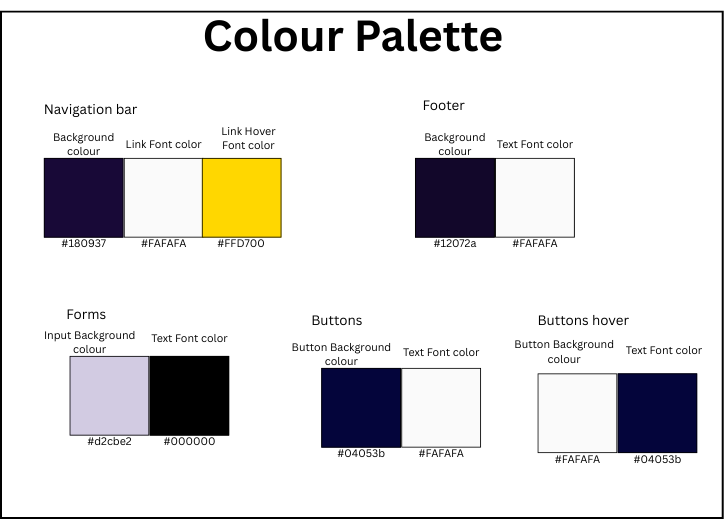
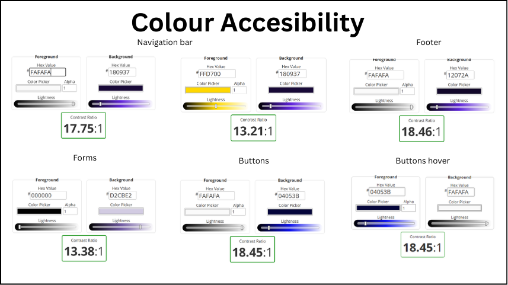

# To-Do List

## Project Purpose

The purpose of this project is to design and develop an internal taska management for a fictional company (Streamline Productivity Solutions).

This project is developed as a guided walkthrough project for the Unit 3 - Level 5Web Development, led by Jose.

## Project Planing

### User stories

This project conatains several user stories for users and aminitrators.  
User stories can be checked [here](documentation/user_stories/user_stories_to_do_list.pdf)

### Colour decisions

The colour palette for this project was selected based on principles of usability, accessibility, and design standards.

Colour choices were made following accesibility best practices:
* High contrast between text and background to improve3 readibility.
* Clear Visual differentiation between button actions.

**Contrast Colour Validation**
